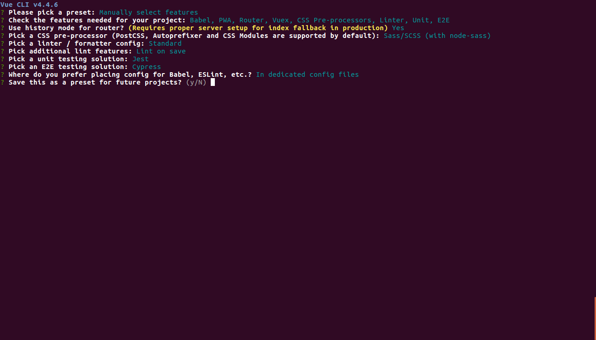

# training-component-basics

## Project setup
```
npm install
```

### Compiles and hot-reloads for development
```
npm run serve
```

### Compiles and minifies for production
```
npm run build
```

### Run your unit tests
```
npm run test:unit
```

### Run your end-to-end tests
```
npm run test:e2e
```

### Lints and fixes files
```
npm run lint
```

### Customize configuration
See [Configuration Reference](https://cli.vuejs.org/config/).


# Training

## Install vue cli
 `npm install -g @vue/cli`

## Check version
`vue --version`

## Check version
`vue run serve`

## Create new project

`vue create training-component-basics`



------------------------------------------------

## What's vue
 - Progressive web framework
 - javascript based

# DOM & Virtual DOM

https://medium.com/js-dojo/whats-the-deal-with-vue-s-virtual-dom-3ed4fc0dbb20


## Vue template parsing

https://jsfiddle.net/marcoslcit/s0mdp4v2/20/

### Diretivas
 - v-if 
 - v-show
 - v-for
   - v-key
  
## Reactivity

(no local)
`window.appVue.$children[0].novotit = "Titulo"`

 - data
 - computed
 - props
  
https://vuejs.org/v2/guide/reactivity.html

https://developer.mozilla.org/en-US/docs/Web/JavaScript/Reference/Global_Objects/Object/defineProperty

## Vue lifecycle
https://vuejs.org/v2/guide/instance.html


## Components
https://jsfiddle.net/marcoslcit/s0mdp4v2/23/

Outra forma de definir os componentes (inline):

https://jsfiddle.net/marcoslcit/s0mdp4v2/25/

### Props

 - property validation
 - Passing information into component

### Watchers e Computed 

### Data (as function)

### Event flow (v-on / @)

### v-bind e input management

### Dynamic components
 - :is

## Vue-router

## Vuex